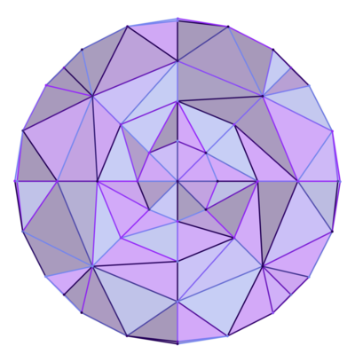

# Triangle Fields
A sketch plugin for generating tessellations with [Delaunay Triangulation](https://en.wikipedia.org/wiki/Delaunay_triangulation).

## Installation
- [Download the plugin repository](https://github.com/0la0/triangle-fields/archive/master.zip)
- Unzip the repo, and double-click the triangle-fields.sketchplugin file
- Set your parameters, select a shape, click 'Generate', and off you go!

## Generation Options

* ### Random
An evenly distributed random field.  

* ### Random-Parabolic:
A random distribution with a higher probability of points being generated near the centroid of the selected shape.  

* ### Grid
Points evenly distributed on a cartesian plane.  

* ### Radial
Points evenly distributed on a polar coordinate system with the center being the centroid of the selected shape.   

