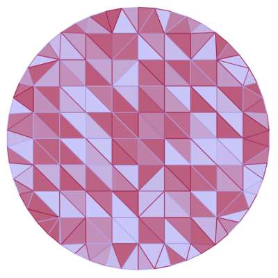

### Triangle Fields
A sketch plugin for generating tessellations with [Delaunay Triangulation](https://en.wikipedia.org/wiki/Delaunay_triangulation).

### Installation
- [Download the plugin repository](https://github.com/0la0/triangle-fields/archive/master.zip)
- Unzip the repo, and double-click the triangle-field.sketchplugin file
- Set your parameters, select a shape, and click the "Generate" button

### Generation Options

Random

Random-Parabolic: A random distribution with a higher probability of points being generated near the center of the shape.

Grid

Radial

